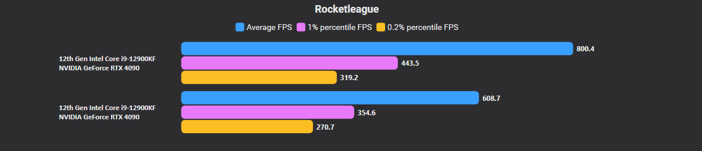
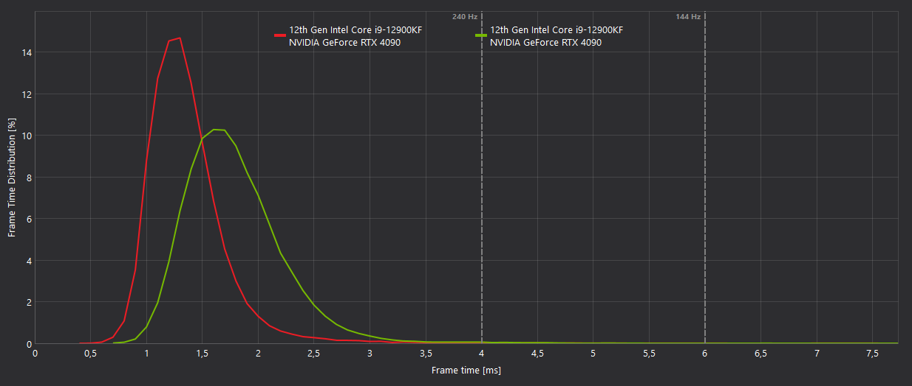

**Otimizador de `TASystemSettings.ini` · 3 modos · Launch Options Steam/Epic · 1 arquivo `.exe`**

[Website](https://guttytech.com) · [Contato](https://guttytech.com/comunidade)

---

## Inicio rapido

1. Baixe o **`GuttyRL.exe`** na aba [Releases](https://github.com/guttytech-cmyk/GuttyTECH-RL-Script/releases).
2. Feche o Rocket League.
3. De 2 cliques no `.exe` e escolha um modo:

| Opcao | Modo | Para quem |
|:---:|------|-----------|
| `[1]` | **COMPLETO** | FPS maximo, graficos minimos (competitivo / PC fraco) |
| `[2]` | **CRIADOR** | Otimizado sem destruir o visual (streamers / YouTubers) |
| `[3]` | **REMOVER** | Restaura o original / padrao de fabrica |
| `[4]` | **LAUNCH OPTIONS** | Copia o melhor comando de inicializacao (Steam/Epic) pro clipboard |

> **Descricao completa (tudo que o .exe faz, linha por linha):** [**DESCRICAO.md**](DESCRICAO.md)

---

## Modos

- **COMPLETO** — texturas 16px, LOD maximo, sombras/efeitos OFF + 6 otimizacoes extras (draw distance, texture streaming, decals, motion-blur skinning, LOD bias de skeletal/particulas).
- **CRIADOR** — texturas 1024px com anisotropico 16, reflexos/iluminacao/HDR preservados; corta o que pesa e pouco aparece (sombras dinamicas, AO, motion blur, DoF).
- **REMOVER** — restaura o backup do seu `.ini` original (ou o stock), preservando sua resolucao, e destrava o arquivo.

---

## Benchmarks — CapFrameX

> Medicao do stack **V21 OMEGA** (Ring-0 + INI, hoje preservado em [`legacy/`](legacy/)). A v22.2 entrega a camada de **INI** desses ganhos de forma segura, sem tocar no sistema.

**Hardware:** Intel Core i9-12900KF · NVIDIA GeForce RTX 4090

| Metrica | Antes | Depois | Ganho |
|---------|------:|-------:|------:|
| Media FPS | 608.72 | **800.41** | **+31.5%** |
| Mediana | 629.33 | **833.82** | **+32.5%** |
| 1% Low | 354.57 | **443.52** | **+25.1%** |
| 0.1% Low | 240.99 | **262.11** | **+8.8%** |
| Maximo | 1,641.77 | **3,060.91** | +86.4% |

---

## Por que a UE3 engasga

A Unreal Engine 3 forca texture streaming, GC sincrono, limitadores de frame e `OneFrameThreadLag` — micro-stutters de ate **150ms** no frametime. Os modos do GuttyRL atacam esses gargalos no nivel de config do jogo.

---

## Seguranca

- Mexe so no `TASystemSettings.ini` (config do jogo) — **nao** toca no Windows.
- Backup automatico antes de cada alteracao (`%USERPROFILE%\GuttyTECH\RL-Optimizer-v22\Backups`).
- Rollback instantaneo (opcao `[3]`).
- Flags de launch validadas contra o Easy Anti-Cheat.
- O `legacy/RL_GUTTYTECH_v21.5.bat` faz tweaks de Ring-0/registro e exige Administrador — use por conta propria.

---

