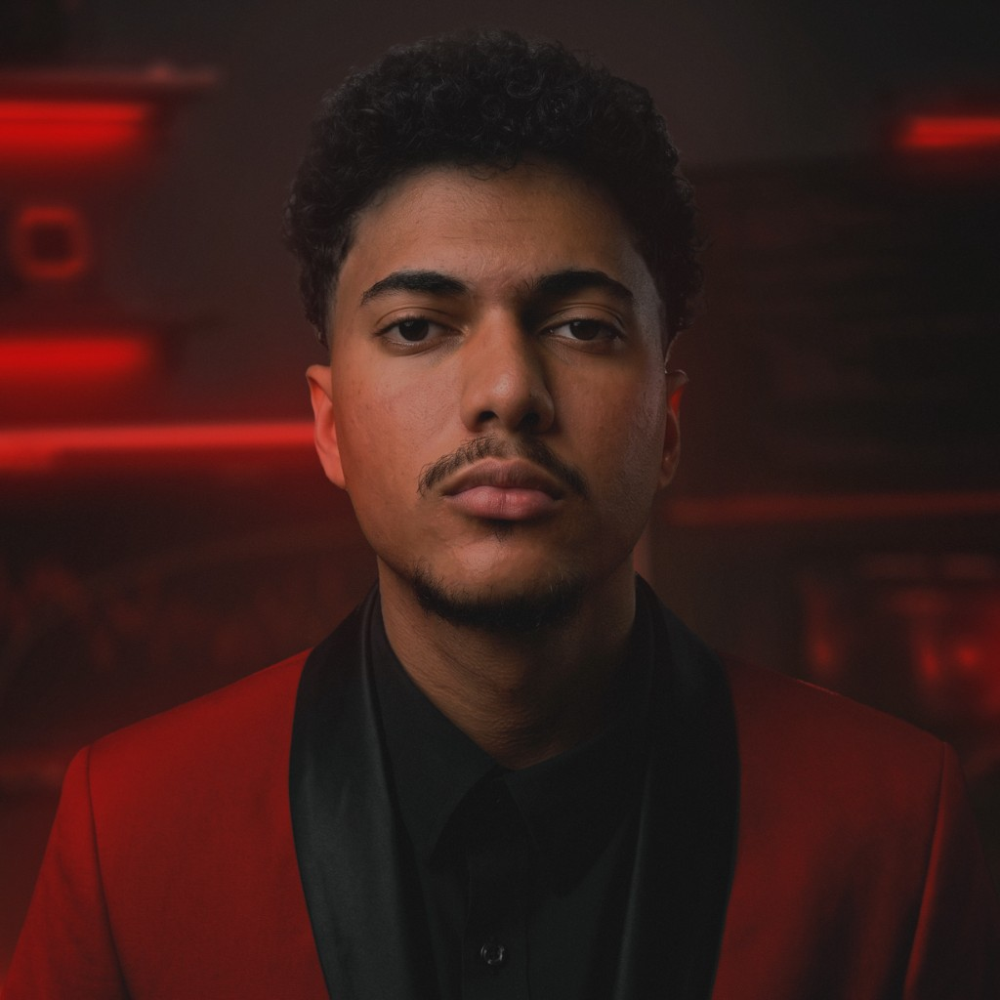

<div align="center">




# GUTTYTECH · RL OPTIMIZER
### v25.0.5 — competitivo · WPF · single-file

Otimiza o Rocket League no nível de config: **INI + menu de vídeo + watcher**.  
Sem mexer no Windows. Seguro com Easy Anti-Cheat.

<br/>

[](https://github.com/guttytech-cmyk/GuttyTECH-RL-Script/releases/latest)
[](https://guttytech.com)
[](https://guttytech.com/comunidade)

<br/>


</div>

---

<br/>

## Por que existe

A Unreal Engine 3 do Rocket League empurra texture streaming, pós-processamento e caps de frame que viram **stutter e input lag**.  
O GuttyTECH RL Optimizer corta o que sobra — com dois perfis e recuperação embutida.

<br/>

<div align="center">

| | | |
|:---:|:---:|:---:|
| **COMPLETO** | **CRIADOR** | **PROTEÇÃO** |
| FPS no teto · visual batata | Stream/clip sem parecer stock | Watcher anti-rewrite |
| Texturas **2×2** · efeitos OFF | Visual legível + cortes invisíveis | INI gravável · menu intacto |

</div>

<br/>

---

## Início em 60 segundos

```text
1. Baixe GuttyTECH_RL.exe  →  Releases (latest)
2. Feche o Rocket League
3. Clique direito → Executar como administrador
4. SmartScreen?  →  Mais informações  →  Executar assim mesmo
5. Escolha COMPLETO ou CRIADOR
```

<div align="center">

| Página | Função |
|:------:|--------|
| **01 · Visão Geral** | Modo ativo · watcher · caminho do INI |
| **02 · Otimização** | Aplicar COMPLETO ou CRIADOR |
| **03 · Recuperação** | Permissões · perfil · boot · save · EAC 30005 |
| **04 · Sistema** | Remover · launch options · ZIP de suporte |

</div>

<details>
<summary><strong>Detalhe técnico (INI, sync, chaves)</strong></summary>

<br/>

Leia o dossiê completo → [**DESCRICAO.md**](DESCRICAO.md)

</details>

<br/>

---

## O que o app faz

<table>
<tr>
<td width="50%" valign="top">

#### Pipeline
- Localiza `TASystemSettings.ini` sozinho  
- Backup com data/hora  
- Preserva resolução e borda  
- Sync de vídeo no `.save` (Epic + Steam)  
- Watcher quando o jogo fecha  

</td>
<td width="50%" valign="top">

#### Sistema
- Admin obrigatório (estável)  
- Copiar launch → clipboard + Desktop  
- ZIP de suporte pra mandar no chat  
- Remover → stock limpo  

</td>
</tr>
</table>

> **Não toca** em Windows, registro, rede, HPET ou TCP.  
> Ring-0 antigo vive só em [`legacy/`](legacy/) — use por conta própria.

<br/>

### Launch options

```bash
-nomovie -NOSPLASH -nomansky +mat_antialias 0 -high
```

Cole na Steam (*Opções de inicialização*) ou na Epic (*Argumentos de linha de comando*).  
Stutter / áudio estranho? Remova o `-high`.

<br/>

---

## Benchmarks

<div align="center">

**CapFrameX** · stack histórico V21 (INI + Ring-0) · hardware i9-12900KF + RTX 4090  
A **v25** entrega a camada INI + save + watcher desses ganhos — sem tocar no SO.

| | Antes | Depois | Δ |
|:--|--:|--:|--:|
| Média | 608.7 | **800.4** | **+31.5%** |
| Mediana | 629.3 | **833.8** | **+32.5%** |
| 1% low | 354.6 | **443.5** | **+25.1%** |
| 0.1% low | 241.0 | **262.1** | **+8.8%** |
| Pico | 1 642 | **3 061** | +86% |

<br/>


<br/>


</div>

<br/>

---

## Requisitos & segurança

<div align="center">

| Requisito | Detalhe |
|:---------:|---------|
| OS | Windows 10 / 11 |
| Privs | **Administrador** |
| Jogo | Rocket League · Steam ou Epic |
| Runtime | Sem .NET no cliente (single-file) |

</div>

- Só config do jogo — **sem** patch de binário  
- Backup antes de cada apply · rollback via Remover / Recuperação  
- Flags de launch compatíveis com **Easy Anti-Cheat**

<br/>

---

## Changelog

```diff
+ v25.0.5  detecção modo/admin · recuperação · clipboard elevado · ZIP suporte
+ v25.0.1  EAC 30005 · Completo/Criador FPS · watcher
+ v25.0.0  UI WPF · motion · startup robusto
```

[CHANGELOG.md](CHANGELOG.md) · [Todas as releases](https://github.com/guttytech-cmyk/GuttyTECH-RL-Script/releases)

<br/>

---

<div align="center">


**[Baixar latest](https://github.com/guttytech-cmyk/GuttyTECH-RL-Script/releases/latest)** · **[guttytech.com](https://guttytech.com)** · **[DESCRICAO.md](DESCRICAO.md)**

<br/>

<sub>Feito pra quem joga a sério — não pra quem coleciona flags de YouTube.</sub>

</div>
